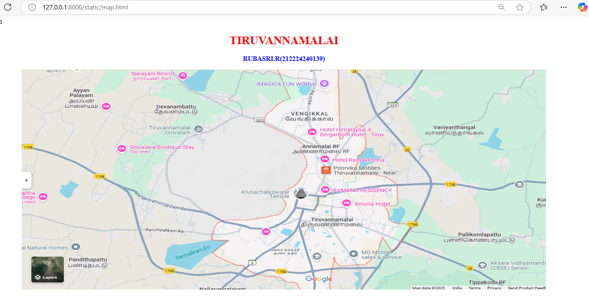
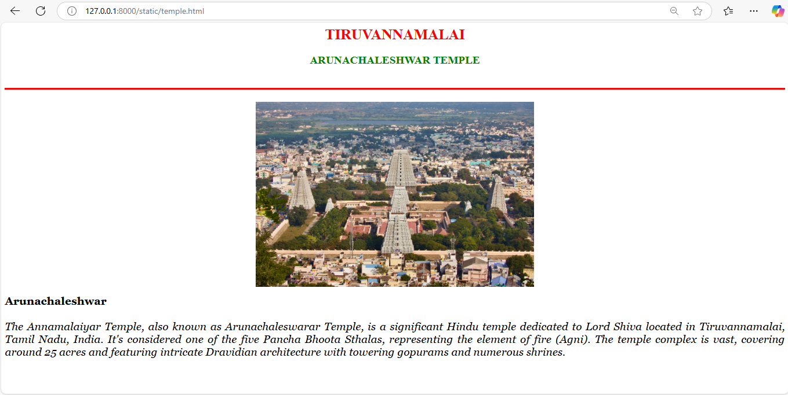
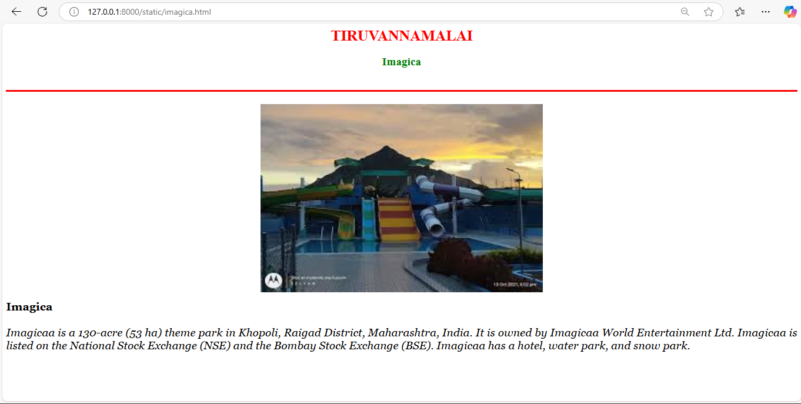
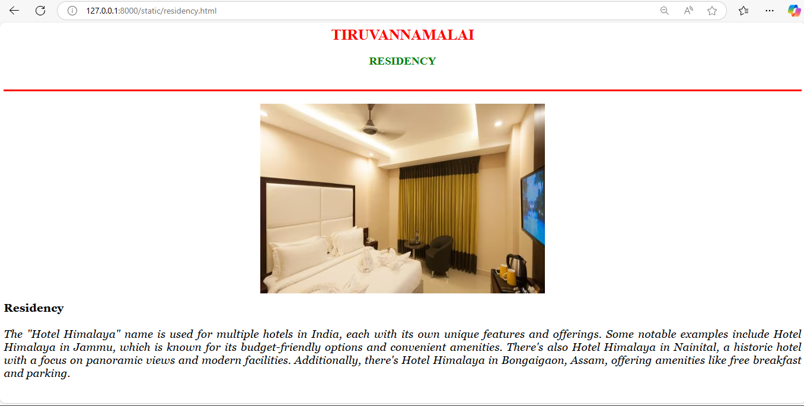

# Ex04 Places Around Me
## Date: 23.04.2025

## AIM
To develop a website to display details about the places around my house.

## DESIGN STEPS

### STEP 1
Create a Django admin interface.

### STEP 2
Download your city map from Google.

### STEP 3
Using ```<map>``` tag name the map.

### STEP 4
Create clickable regions in the image using ```<area>``` tag.

### STEP 5
Write HTML programs for all the regions identified.

### STEP 6
Execute the programs and publish them.

## CODE
```
map.html

<html>
    <head>
        <title>My City</title>
    </head>
    <body>
        <h1 align="center">
            <font color="red"><b>TIRUVANNAMALAI</b></font>
        </h1>
        <h3 align="center">
            <font color="blue"><b>RUBASRI.R(212224240139)</b></font>
        </h3>
        <center>
            
            <map name="MyCity">
                <area shape="poly" coords="502,339,665,333,662,388,503,393" title="Temple" href="temple.html">
                <area shape="poly" coords="526,23,709,18,709,72,537,78" title="Imagica World" href="imagica.html">
                <area shape="poly" coords="687,329,686,366,847,360,844,325" title="residency" href="residency.html">
                
    
            </map>
        </center>  
    </body>
</html>

temple.html

<html>
    <head>
        <title>My City</title>
    </head>
    <body>
        <h1 align="center">
            <font color="red"><b>TIRUVANNAMALAI</b></font>
        </h1>
        <h2 align="center">
            <font color="green"><b>ARUNACHALESHWAR TEMPLE</b></font>
        </h2>
        <br>
        <hr size="3" color="red">
        <br>
        <center>
        </center>
        <p align="justify">
            <font face="Georgia" size="5" color="black">
            <b>Arunachaleshwar </b>
            <br>
            <br><i>
            The Annamalaiyar Temple, also known as Arunachaleswarar Temple, is a significant Hindu temple dedicated to Lord Shiva located in Tiruvannamalai, Tamil Nadu, India. It's considered one of the five Pancha Bhoota Sthalas, representing the element of fire (Agni). The temple complex is vast, covering around 25 acres and featuring intricate Dravidian architecture with towering gopurams and numerous shrines. </i>
            </font>
        </p>
    </body>
</html>

imagica.html

    <html>
    <head>
        <title>My City</title>
    </head>
    <body>
        <h1 align="center">
            <font color="red"><b>TIRUVANNAMALAI</b></font>
        </h1>
        <h2 align="center">
            <font color="green"><b>Imagica</b></font>
        </h2>
        <br>
        <hr size="3" color="red">
        <br>
        <center>
        </center>
        <p align="justify">
            <font face="Georgia" size="5" color="black">
            <b>Imagica </b>
            <br>
            <br><i>
                Imagicaa is a 130-acre (53 ha) theme park in Khopoli, Raigad District, Maharashtra, India. It is owned by Imagicaa World Entertainment Ltd. Imagicaa is listed on the National Stock Exchange (NSE) and the Bombay Stock Exchange (BSE). Imagicaa has a hotel, water park, and snow park.
            </font>
        </p>
    </body>
</html>

residency.html

<html>
    <head>
        <title>My City</title>
    </head>
    <body>
        <h1 align="center">
            <font color="red"><b>TIRUVANNAMALAI</b></font>
        </h1>
        <h2 align="center">
            <font color="green"><b>RESIDENCY</b></font>
        </h2>
        <br>
        <hr size="3" color="red">
        <br>
        <center>
        </center>
        <p align="justify">
            <font face="Georgia" size="5" color="black">
            <b>Residency </b>
            <br>
            <br><i>
                The "Hotel Himalaya" name is used for multiple hotels in India, each with its own unique features and offerings. Some notable examples include Hotel Himalaya in Jammu, which is known for its budget-friendly options and convenient amenities. There's also Hotel Himalaya in Nainital, a historic hotel with a focus on panoramic views and modern facilities. Additionally, there's Hotel Himalaya in Bongaigaon, Assam, offering amenities like free breakfast and parking. 
 </i>

            </font>
        </p>
    </body>
</html>
```
            

## OUTPUT









## RESULT
The program for implementing image maps using HTML is executed successfully..
